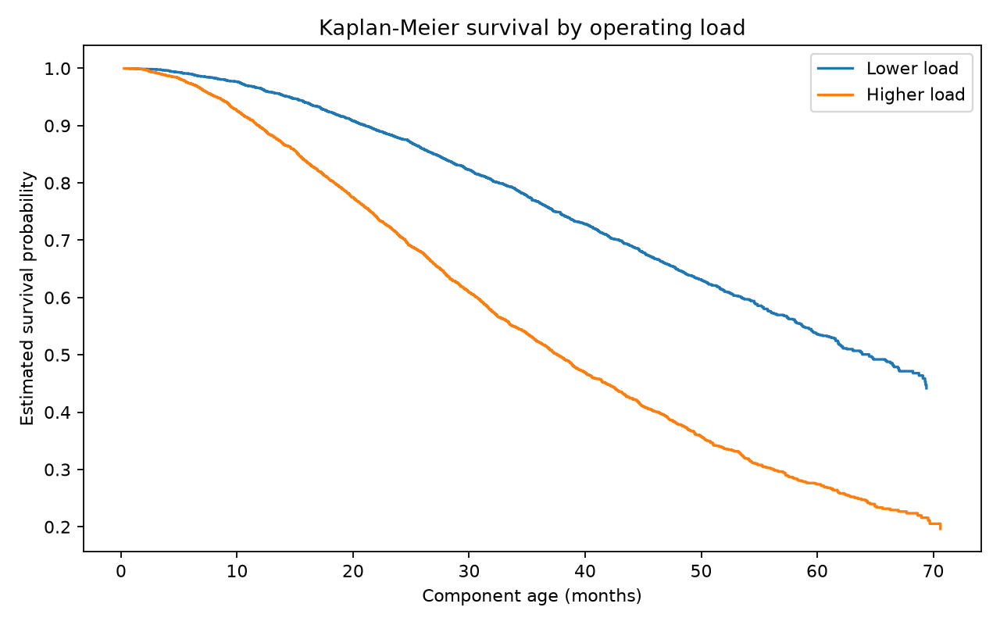
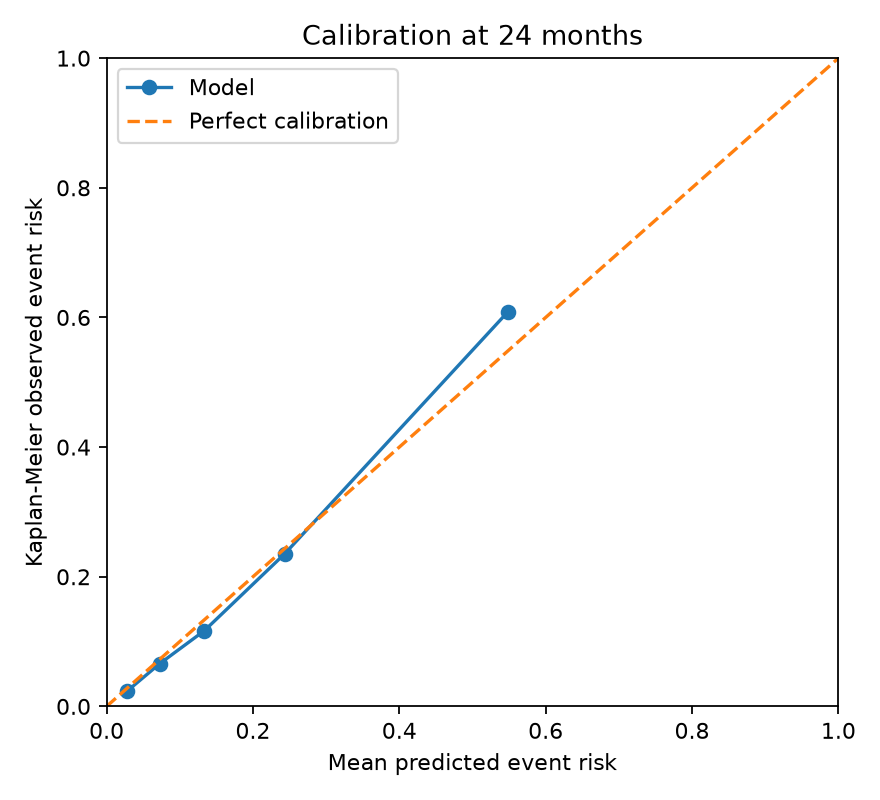

# Vehicle Component Failure Risk Platform

A production-oriented statistical modeling project for estimating component failure risk in a commercial vehicle fleet using **survival analysis**.

The project is intentionally built with **synthetic data only** so it can be published safely. It contains no proprietary OEM, vehicle, warranty, supplier, or manufacturing information.

## What this project demonstrates

- Right-censored reliability data generation
- Kaplan-Meier survival analysis
- Log-rank testing
- Cox Proportional Hazards modeling
- Weibull Accelerated Failure Time modeling
- Hazard ratios, confidence intervals, and p-values
- Proportional-hazards diagnostics with Schoenfeld residuals
- Harrell's C-index
- IPCW Brier scores under right censoring
- Risk calibration using Kaplan-Meier observed event rates
- Temporal cohort holdout rather than a purely random split
- Conditional 30, 60, and 90 day failure risk
- FastAPI model serving
- Batch scoring
- Prometheus metrics
- Basic feature drift monitoring
- Docker packaging
- GitHub Actions CI

## Business problem

A fleet or reliability team wants to answer:

> For an active vehicle component that has survived to its current age, what is its probability of failing during the next 30, 60, or 90 days, and which operating factors are associated with higher failure hazard?

Unlike a simple binary classifier, survival analysis correctly handles vehicles that **have not failed yet** when the observation period ends. These observations are right censored rather than incorrectly treated as permanent non-failures.

## Architecture

```text
Synthetic fleet histories
        |
        v
Data validation
        |
        v
Exploratory survival analysis
        |
        +-------------------------+
        |                         |
        v                         v
Kaplan-Meier / log-rank      Feature preprocessing
                                  |
                         +--------+--------+
                         |                 |
                         v                 v
                     Cox PH          Weibull AFT
                         |                 |
                         +--------+--------+
                                  |
                    C-index + IPCW Brier
                    calibration + diagnostics
                                  |
                                  v
                       Model selection policy
                                  |
                                  v
                         Versioned model bundle
                          /               \
                         v                 v
                    FastAPI API       Batch scoring
                         |                 |
                         +--------+--------+
                                  |
                                  v
                         Drift / API monitoring
```

## Dataset

The repository includes a reproducible synthetic dataset with **8,000 component histories**.

Current generated dataset characteristics:

- 8,000 assets
- 43.9% observed failures
- 56.1% right-censored observations
- Temporal training set: 6,054 rows
- Later-cohort holdout set: 1,946 rows

Features include:

- vehicle class
- monthly mileage
- monthly engine hours
- load factor
- temperature exposure
- prior repairs
- service delay days
- route severity
- preventive maintenance score

The hidden data-generating process intentionally increases failure hazard for harsher usage and maintenance delay, while stronger preventive maintenance is protective. This lets the statistical models recover meaningful directions rather than learning random noise.

## Current model results

The pipeline fits both Cox PH and Weibull AFT models and compares them on the later-cohort holdout set.

| Model | C-index | Brier 12m | Brier 24m | Brier 36m | 3-point Brier average |
|---|---:|---:|---:|---:|---:|
| Cox PH | 0.7966 | 0.0552 | 0.1152 | 0.1438 | 0.1048 |
| Weibull AFT | 0.7966 | 0.0553 | 0.1151 | 0.1438 | 0.1047 |

The selected production model is **Cox PH** because predictive performance is effectively tied while Cox provides straightforward hazard-ratio interpretation for reliability teams.

### Survival and calibration outputs





Example recovered Cox effects from the synthetic data:

- Higher load factor: hazard ratio around 1.93 per standardized unit
- Higher route severity: hazard ratio around 1.62
- Higher temperature exposure: hazard ratio around 1.54
- Stronger preventive maintenance: hazard ratio around 0.57, indicating a protective association

See `reports/tables/cox_hazard_ratios.csv` for the full table and confidence intervals.

## Why C-index is not enough

The pipeline does not select a model using discrimination alone.

It also calculates:

- IPCW Brier score at 12, 24, and 36 months
- calibration by predicted-risk quantile using Kaplan-Meier observed risk
- Schoenfeld-residual time-correlation diagnostics
- log-rank comparison between high-load and lower-load groups

This separates **ranking quality**, **probability quality**, **assumption checking**, and **statistical group comparison**.

## Quick start

### 1. Create an environment

```bash
python -m venv .venv
source .venv/bin/activate
```

Windows PowerShell:

```powershell
python -m venv .venv
.\.venv\Scripts\Activate.ps1
```

### 2. Install

```bash
pip install -r requirements-dev.txt
```

### 3. Run the complete pipeline

```bash
python scripts/run_all.py
```

This will train both survival models, evaluate them, create plots and tables, select a model, and write the model artifact.

### 4. Start the API

```bash
uvicorn failure_risk.api:app --host 0.0.0.0 --port 8000
```

Open:

```text
http://localhost:8000/docs
```

### 5. Score one vehicle

```bash
curl -X POST "http://localhost:8000/predict" \
  -H "Content-Type: application/json" \
  -d '{
    "current_age_months": 30,
    "monthly_km": 6200,
    "engine_hours_per_month": 145,
    "load_factor": 0.86,
    "temperature_exposure": 0.72,
    "prior_repairs": 2,
    "service_delay_days": 14,
    "route_severity": 0.82,
    "preventive_maintenance_score": 0.55,
    "vehicle_class": "Heavy"
  }'
```

Example output from the included trained model:

```json
{
  "risk_30d": 0.4474,
  "risk_60d": 0.7264,
  "risk_90d": 0.8449,
  "risk_level": "HIGH"
}
```

These values are generated from synthetic data and must not be interpreted as real-world vehicle failure probabilities.

## Conditional risk

The API does not report an unconditional survival probability from component installation.

For a component that has already survived to age `t`, the next-horizon risk is calculated as:

```text
P(T <= t+h | T > t, x) = 1 - S(t+h | x) / S(t | x)
```

This distinction is important in maintenance applications because a 30-month-old surviving component has already passed through the first 30 months of risk.

## Batch scoring

```bash
python scripts/create_scoring_sample.py
python -m failure_risk.batch data/scoring_sample.csv reports/batch_scored.csv
```

## Drift monitoring demo

```bash
python scripts/drift_demo.py
```

The demo intentionally shifts mileage and load distributions and produces `reports/drift_demo.json` using Kolmogorov-Smirnov tests plus categorical distribution monitoring.

## Docker

Train first so the model artifact exists:

```bash
python scripts/run_all.py
docker build -t vehicle-failure-risk:latest .
docker run -p 8000:8000 vehicle-failure-risk:latest
```

Or:

```bash
docker compose up --build
```

## Testing

```bash
pytest -q
```

Current repository tests cover:

- deterministic synthetic data generation
- dataset validation
- Weibull AFT survival monotonicity
- C-index behavior
- FastAPI health endpoint

## Repository structure

```text
vehicle_failure_survival_project/
├── failure_risk/
│   ├── api.py
│   ├── batch.py
│   ├── config.py
│   ├── data.py
│   ├── evaluation.py
│   ├── inference.py
│   ├── models.py
│   ├── monitoring.py
│   └── train.py
├── data/
│   ├── synthetic/
│   └── scoring_sample.csv
├── artifacts/
├── reports/
│   ├── plots/
│   └── tables/
├── notebooks/
├── scripts/
├── tests/
├── docs/
├── .github/workflows/ci.yml
├── Dockerfile
├── docker-compose.yml
├── Makefile
└── README.md
```

## Production hardening roadmap

This repository is intentionally production-oriented, but it is still a portfolio system. A real enterprise rollout should add:

1. authenticated API access and authorization
2. managed model registry and artifact storage
3. scheduled batch scoring through a workflow orchestrator
4. feature store or governed feature pipeline
5. outcome feedback once failures mature
6. rolling calibration and C-index monitoring
7. alerting on data drift and performance degradation
8. blue/green or canary model releases
9. audit logging and model governance approval
10. retraining policy triggered by data volume and performance decay

## Resume-ready positioning

Use only after you have personally run and understood the project:

> **Vehicle Failure Survival Risk Platform:** Built an end-to-end statistical reliability platform on 8,000 synthetic commercial-vehicle component histories using Kaplan-Meier analysis, Cox proportional hazards and Weibull AFT models, explicitly modeling right censoring and evaluating discrimination, calibration and proportional-hazards assumptions. Productionized conditional 30/60/90-day risk scoring through FastAPI, Docker, batch inference, CI and drift monitoring.

A shorter version:

> Built a survival-analysis failure-risk platform using Cox PH and Weibull AFT models, achieving ~0.80 holdout C-index on 8,000 right-censored synthetic vehicle histories; served calibrated 30/60/90-day conditional risk through FastAPI with Docker, CI, batch scoring and drift monitoring.

## Important honesty note

The data and performance in this project are synthetic. Do not place this under an employer's experience section or imply that these results were achieved on confidential OEM data. Present it as a portfolio project demonstrating statistical modeling and production ML engineering.
